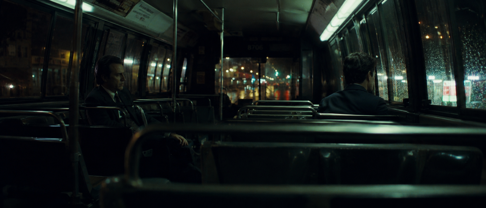

[中文](README.md) | **English**

# Dream Director · 造梦师

**Turn an idea into a visual plan you can generate, revise, and continue.**

Start with a story, screenplay excerpt, or references. Establish the scene, develop the visual world, and compile model-native prompts and scoped repair instructions.

**v2.5.0 stable** · [Download the release](https://github.com/popopo-99/zy-cinematic-realism/releases/tag/v2.5.0) · [60-second start](#quick-start) · [Screenplay example](docs/titanic-story-to-frame.md) · [Examples](#showcase) · [Installation guide](docs/getting-started_EN.md)



<sub>The author's existing AIGC work: distance, seat occlusion, and practical light express a failed investigation. Not regenerated as a v2.4 test result. [Original image](docs/images/hero-night-bus.png)</sub>

A visual-creation Skill for ChatGPT / Codex. You get a copyable prompt, with brief visual decisions, a Decode Card, or continuity planning when needed. Image generation requires the features available in your environment; installing the Skill does not automatically invoke an API or select the underlying model.

The technical name and invocation remain `zy-cinematic-realism` / `$zy-cinematic-realism`.

<a id="input-card"></a>
<a id="quick-start"></a>
## Start in 60 Seconds

After installation, copy:

```text
Use $zy-cinematic-realism:
Rainy night, inside a
convenience store.
A woman just off work
holds hot coffee in both
hands, looking away
from camera.
Give me an MJ prompt.
Explain the moment,
viewpoint, and main light.
No advertising poses or
unmotivated rim light.
```

At minimum: **who, where, the action now, and what to avoid**. State any fixed framing, light, ratio, or model directly.

Continue naturally:

```text
Keep the person, action, and light.
Only move the camera
outside the awning,
looking through glass.
```

Add “prompt only” for a copyable prompt without explanation. Ask for the Scene Master, four-axis director breakdown, or continuity plan when you want depth. The Skill keeps the established model; it asks once only when an unknown target materially affects compilation. You can request a model-neutral version first.

**Not installed?** See [installation](docs/getting-started_EN.md). Without a Skills entry point, paste the [self-contained chat starter](docs/chat-starter-en.md); this basic edition omits the complete director library and model parameter adapters.

<a id="core-workflows"></a>
<a id="continuity"></a>
<a id="prompt-doctor"></a>
<a id="use-cases"></a>
## Start with What You Have

- **Story / screenplay**: “Develop a scene art concept to discuss with the director.” / “Choose key frames where the relationship changes.”<br>→ Art concepts explore candidate spaces, materials, character looks, props, and light; narrative key frames show one specific moment

- **Idea**: “Two detectives ride a night bus after a failed interrogation. Give me a cinematic still prompt.”<br>→ Brief decisions and a target-native prompt

- **Reference**: “A supplies color; B supplies composition. Replace the content with a watchmaker before dawn.”<br>→ Roles, core rules, and a new-scene prompt

- **Repair**: “Identity and framing are right. Fix only the commercial-looking light.”<br>→ Up to three dominant failures and scoped repair

- **Series**: “Eight urban-knight shots; preserve face, armor, garage, and sources.”<br>→ Continuity, shot list, and controlled deltas

- **Variation**: “Same scene, compile for Seedream.” / “Change only the camera.”<br>→ Transcode or a one-variable variation

- **Resume**: “Make a handoff card with accepted changes and the next step.”<br>→ Complete portable project state

References contribute only within assigned roles. Paper illustration does not default to photography; an identity reference does not take over the medium. Analysis-only requests receive no unwanted generation prompt.

For an existing story or script, one sentence describing the task is enough. Analysis-only requests stay analysis-only. An art concept or frame plan still needs model-native prompt compilation; the Skill does not generate images automatically.

<a id="story-to-frame"></a>
## Screenplay to Frames: Titanic's Third-Class Dance

An awkward first dance, active participation after removing her shoes, and laughter after being caught beside a table. Read the change, develop a shared visual world, then turn actions and relationships into key frames.

[Workflow and actual result status](docs/titanic-story-to-frame.md): script facts, interpretation, and new directing proposals lead into reference decoding, external generation, and inspection. The case shows the P01 direction and the new P02/P03 images confirmed usable by the user, together with the supplied prompts and actual result observations.

### Original Short Story: Art Concepts and Relationship Key Frames

[The Last Photo trial](docs/last-photo-art-development.md): three follow-up external images are approved by the user for case display: an invitation through an empty chair, a shoulder lean with a small smile, and an empty-room art concept. They show the different purposes of art development and relationship key frames; production details remain open.

<a id="showcase"></a>
## Three Ways to See the Method

### 1. Choose a Specific Story Moment


A task lamp, unfinished coffee, and doorway viewpoint show that the case continues. Action, space, and sources come before lens or film labels. Waiting and aftermath are options; requested daylight joy, celebration, and climactic action remain valid directions.

```text
Use $zy-cinematic-realism:
A detective comes home late, coat still on, and checks the case files again beside a table lamp.
Eye-level view from the doorway. Give me a model-neutral prompt using practical sources.
```

[More story moments, boxing, and historical work](docs/visual-guide_EN.md). Images are existing author work; reusable calls do not promise identical regeneration.

<a id="director-method"></a>
<a id="creative-grammar"></a>
### 2. Change How the Scene Is Witnessed

<table>
  <tr>
    <td width="50%"><br><strong>No-director baseline</strong><br>Investigative action</td>
    <td width="50%"><br><strong>Wong Kar-wai · historical strong mode</strong><br>Reflections, obstruction, and nocturnal relationships</td>
  </tr>
</table>

v2.4 honors **subtle / clear / strong**; unspecified strength defaults to clear. Subtle uses selected compatible traits. Strong changes only open decisions. Locked action, camera, composition, and sources are not reselected to manufacture difference.

```text
Use $zy-cinematic-realism:
A young officer searches a video shop during a blackout for a tape. Subtle Diao Yinan reference.
Keep medium framing, the searching action, and the doorway camera. Give me an MJ prompt.
```

[38-director index](zy-cinematic-realism/references/directors/index.md) · [Strength and locks](zy-cinematic-realism/references/director-routing.md) · [Six historical calls and prompts](docs/director-style-comparison.md)

<a id="dream-decode"></a>
### 3. Decode the Rules, Replace the Content

The night-bus cover lets us discuss cool practical light with small warm highlights, subject-to-space relationships, glass reflection, and selective visibility. The bus, detectives, and seats do not have to enter the next scene.

```text
Use $zy-cinematic-realism:
Use only the attached night-bus image's color, exposure, and material relationships.
New scene: an elderly watchmaker closes a pocket watch before dawn. Chest-up medium framing is locked.
Do not import the bus, detectives, or clothing. Decode, then give a model-neutral prompt.
```

[Reference, five core rules, complete reuse card, and transfer prompt](docs/dream-decode-example.md). **This is a text worked example grounded in an actual reference. The transferred image has not been generated; it is not an image-level v2.4 comparison.**

Reuse the card in the same conversation; supply its full contents again in a new one. Reattach accessible images when identity or editing depends on them.

<a id="install-codex"></a>
<a id="use-chatgpt"></a>
<a id="install"></a>
## Install or Upgrade

| Environment | Entry point |
| --- | --- |
| Codex | [Install from GitHub or a local folder](docs/getting-started_EN.md#install-codex) |
| ChatGPT with Skills | [Upload the complete installation ZIP](docs/getting-started_EN.md#use-chatgpt) |
| No Skills entry point | [Paste the self-contained basic chat edition](docs/chat-starter-en.md) |

Download the [complete v2.5.0 package](https://github.com/popopo-99/zy-cinematic-realism/releases/download/v2.5.0/zy-cinematic-realism-v2.5.0.zip) ([SHA-256 checksum](https://github.com/popopo-99/zy-cinematic-realism/releases/download/v2.5.0/zy-cinematic-realism-v2.5.0.zip.sha256)), or install the source from [main](https://github.com/popopo-99/zy-cinematic-realism/tree/main/zy-cinematic-realism). See the [GitHub Release](https://github.com/popopo-99/zy-cinematic-realism/releases/tag/v2.5.0) for version notes.

The installation ZIP has one top-level `zy-cinematic-realism/` folder. Replace the complete old folder and avoid duplicate installations. **SKILL.md alone does not include its referenced method library.**

<a id="model-router"></a>
<a id="model-comparison"></a>
<a id="advanced"></a>
## Go Deeper

`Scene Master + Visual Grammar → Independent Model Compiler → Result Repair`

Story or screenplay work reads character change, develops scene art concepts or narrative key frames for the requested purpose, then joins this pipeline.

Model syntax can change; locked scene facts cannot change silently.

| Topic | Documentation |
| --- | --- |
| Develop art concepts or narrative key frames from a story | [Story to Frame workflow](zy-cinematic-realism/references/story-visual-development.md) · [Titanic example](docs/titanic-story-to-frame.md) |
| Story, directors, and cinematography | [Visual guide and historical work](docs/visual-guide_EN.md) |
| Reference roles, medium, and decode | [Dream Decode](zy-cinematic-realism/references/dream-decode.md) · [Decode Card](zy-cinematic-realism/references/decode-card.md) |
| Iteration and a new conversation | [Project Handoff Card](zy-cinematic-realism/references/project-handoff.md) |
| Series continuity | [Continuity Bible](zy-cinematic-realism/references/continuity-cards.md) |
| Scoped repair | [Prompt Doctor](zy-cinematic-realism/references/result-repair.md) |
| Model compilation and selection | [Compiler](zy-cinematic-realism/references/prompt-compiler.md) · [Router](zy-cinematic-realism/references/model-routing.md) |
| Historical four-model image comparison | [One Scene Master, multiple interpretations](docs/model-comparison.md) |
| Release changes | [v2.5 notes](RELEASE_NOTES.md) · [CHANGELOG](CHANGELOG.md) |

Supports GPT Image 2.5 with explicit GPT Image 2 compatibility, Midjourney V8.2, Seedream 5.0 Pro, Nano Banana, and model-neutral work. Adapters record documentation-check dates; verify current official controls when a frontend changes. Routing heuristics are not permanent rankings.

<a id="repository-structure"></a>
<a id="validation"></a>
## Validation Status

v2.5 adds behavior checks for script facts, character change, visual development, and choosing an individual frame. Static validation, independent text behavior checks, image comparisons, and human usability evaluation are recorded separately.

**A worked example and general improvement are separate claims.** Historical images are not retests for this upgrade; Expected entries in manual regression are specifications, not execution records. See the validation record for the new example's generation, comparison, and check status.

[Current validation record](docs/validation-v2.5.md) · [v2.4 validation history](docs/validation-v2.4.md) · [Manual regression and image comparison protocol](zy-cinematic-realism/tests/manual-regression.md)

The repository root contains tutorials and work; `zy-cinematic-realism/` is the installable Skill. `scripts/` provides static checks and packaging. The ZIP excludes the showcase gallery.

<a id="community"></a>
## Build Dream Director Together

Thanks to everyone who tested, shared, and supported this project. The [complete Special Thanks list and community illustration](docs/community.md) remain available.

Useful feedback includes the input, target model, reference roles, actual result, and what must remain. [Open an issue](https://github.com/popopo-99/zy-cinematic-realism/issues).

<a id="license"></a>
## Attribution and Licensing

Author: **ZY / popopo-99**. Licensed under [CC BY-NC 4.0](LICENSE). Personal study, non-commercial creation, and attributed adaptations follow the license. Commercial use and repackaging require the permissions described in the [complete licensing guide](docs/licensing.md). Generated prompts and user works do not automatically belong to the project author.

[Attribution, restrictions, and commercial contact](docs/licensing.md) · [NOTICE](NOTICE.md)

> Make the frame a specific moment inside a story before deciding which lens or film stock it uses.
