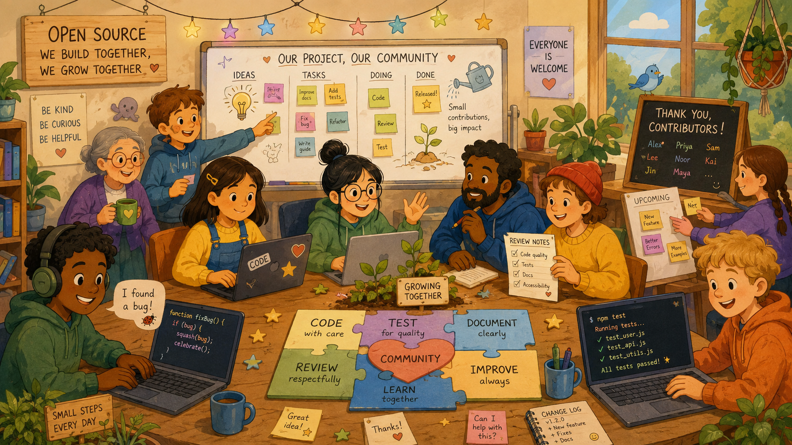

# Special Thanks / 特别感谢

一个开源项目的成长，不只发生在代码、Commit 和版本号里。

从最初的测试，到一次次功能迭代，「造梦师 / DREAM DIRECTOR」一路收到过很多朋友的反馈、建议、分享与帮助。

有人帮我测试不同模型的表现，有人认真反馈使用中遇到的问题，有人分享自己的创作结果，也有人把这个项目推荐给更多创作者。

这些帮助未必都会出现在代码记录里，但它们同样是这个项目的一部分。

所以，我想把这些名字正式留下来。

感谢每一位曾经帮助、支持和陪伴「造梦师 / DREAM DIRECTOR」成长的朋友。

也感谢大家和我一起维护一个尊重原创、尊重来源、愿意分享经验，也愿意彼此帮助的开源创作社区。

### Friends of DREAM DIRECTOR

|             |          |         |          |
| ----------- | -------- | ------- | -------- |
| fuuuk       | 星海       | 方棏木     | Ze       |
| 叶炀01146     | 轩轩同学     | T1-Lumi | 睡眠歌单     |
| 我乃潇洒哥       | 艺算Ariton | 曾成钢     | DLINWANG |
| 豆包爸爸        | 兰天白云     | n次 元漫   | 浪里个浪     |
| zeen        | FFFFENG  | 视野      | 111      |
| 稚           | 空合造物设计   | yokimi. | 吃饭不留证据   |
| Annie\@0830 | Domodaji | 意式刘     | 艾丽Elle   |
| 小萌兔短剧       | Vincent  | 0425\*  | OPfilm   |
| 浮帧AI导演      | 小小超人     | 像素暗室      | Chovy    |
| 摄影师小野     |   aaa7771     |

> 名单展示的是朋友们本人确认可以公开使用的名字、昵称或代号。\
> 名单按收集顺序记录，不代表贡献大小。\
> 如果你也曾参与测试、反馈或帮助这个项目，并希望留下自己的名字，欢迎通过 Issue 与我联系。

[返回 README / Back to README](../README.md)
