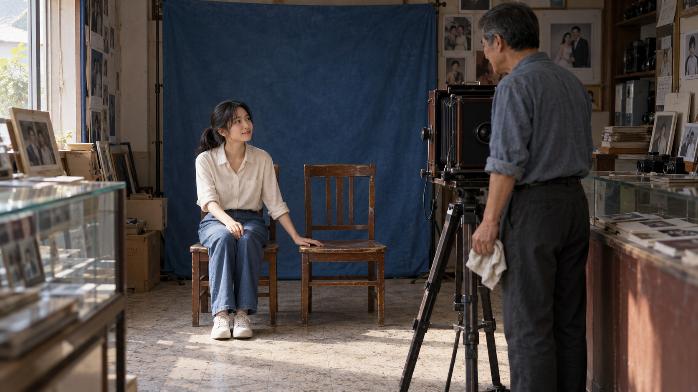
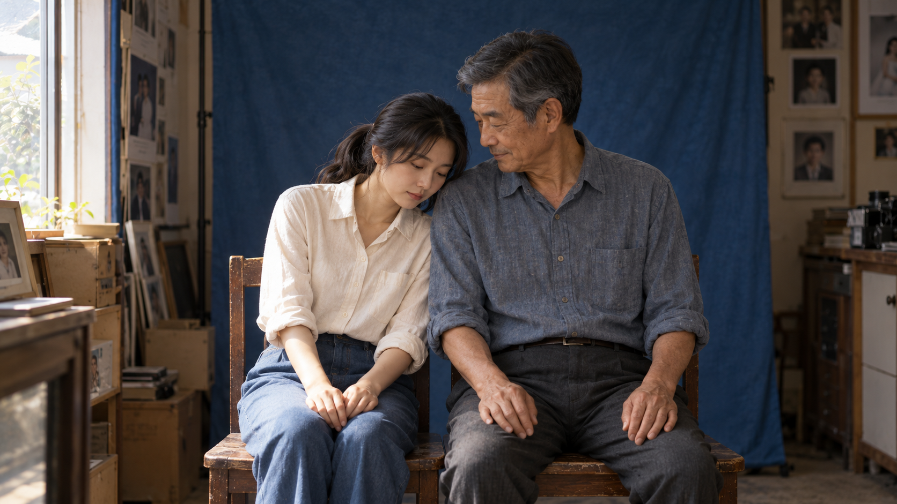
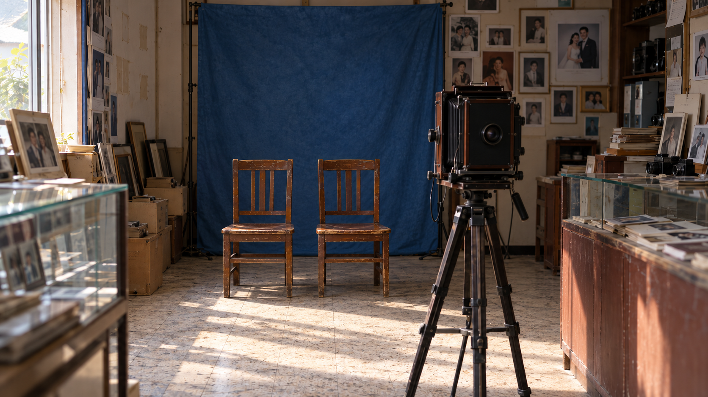

# 《最后一张照片》：从故事到美术概念与关键画面

一个短故事，可以先开发给导演讨论的美术方案，再把人物关系变化变成关键画面。本例从父女关系出发，设计照相馆的空间、材料、造型与光线，使用造梦师编译提示词，由用户在外部 Image2 生成并回传。

故事是为本次试用准备的原创短文。以下展示用户确认可用于案例的后续画面，并保留最初的响应、提案与参考图。这是实际定性试用，不是旧新版本受控比较或最终拍摄定稿。

## 用户确认可用于案例的三张回图

2026-10-04，用户在外部 Image2 生成并回传下面三张图，表示“可以使用”。两张表现人物关系的关键瞬间，一张用于空间美术讨论；这份确认不意味着所有道具、布景和人物细节已经拍摄定稿。

### L01 · 空椅子的邀请



女儿伸手贴住身旁空椅的座面，抬眼看父亲；父亲仍站在摄影器材旁，手里垂握着擦镜布。空椅、手的接触与视线共同表达她希望他坐进合照。

<details>
<summary>本轮提供的 Image2 提示词</summary>

使用时所指的“图一”是下方保留的最初美术图 R01；三条分别以同一 R01 为参考，不把前一张新图作为后一张的输入。这里保留提供给用户的文字，未把回图差异反写进提示词。

```text
生成一张 16:9 横版画面，表现《最后一张照片》中女儿邀请父亲坐到身边、父亲仍留在相机后的那个瞬间。图一是唯一参考附件，只用来保持这一候选案例的父女身份、发型、衣服、照相馆布局、蓝色背景布、木椅、柜台、样片和原有左侧窗光；重新设计当下动作和观看位置，不复制图一已经靠肩的合照姿势、朝前的目光或全屋构图。

这间开了二十多年的照相馆明天关门，现在是下午，墙上的样片正在被收拾。女儿坐在蓝布前左侧的木椅上，仍穿图一的米白衬衫、蓝色长裤和白鞋。她身旁右侧的同款木椅空着，椅背朝蓝布。她靠近空椅的那侧手臂向空椅伸出，那只手掌轻贴椅座靠近自己的那一边，手指自然分开，让手与座面的接触清楚可见；另一只手留在自己的腿上。她没有起身，也没有靠肩，抬眼看右前方的父亲。

父亲穿图一的蓝灰衬衫、深灰长裤和黑鞋，站在右前区合照相机后方、靠店门的一侧，身体仍在三脚架的工作位置，头稍转向女儿，目光落在她脸上。擦镜布松握在一只下垂的手里；他没有迈步去椅子，也没有继续擦镜。场内只有图一的这一台合照相机，镜头仍朝向两把椅子，倒计时尚未开启。父女看向彼此，都不看画面观看者。

画面的观看位置在店内左侧通道、玻璃展示柜右缘外，约与合照相机齐平而稍靠店门，从左前方斜看后区。视点高度接近女儿坐着时的眼睛，能向下看见空椅座面。取景收紧：女儿在左侧中后区，空椅在中央，父亲和合照相机在右侧前区；保留女儿膝部、整块空椅座面与两人的头部，不要求完整房间。父亲、相机和三脚架不得遮住空椅或那只手。手贴椅面的动作是视觉中心，二人的视线关系也必须读得清楚。

下午光从照相馆原有左侧高窗进入，照到女儿靠窗的脸侧、伸出的手、木椅边缘和地砖；右侧柜台附近自然较暗，但父亲侧脸仍可辨认。蓝布、旧木椅、衬衫和玻璃保持图一的材料质感，皮肤保留自然纹理，远处样片不必全部清晰。不要添加雾、装饰性逆光、字幕、倒计时数字或新的剧情动作。只表现手刚落在空椅上、父亲仍在镜头后的这一个时刻。
```

</details>

### L02 · 靠肩后的一小下笑



女儿低头轻靠父亲肩膀，父亲偏头看她，嘴角留着小幅笑意。双人近取景把肩膀接触和表情放到中心，两人都不直视观看者。

<details>
<summary>本轮提供的 Image2 提示词</summary>

使用时所指的“图一”是下方保留的最初美术图 R01；三条分别以同一 R01 为参考，不把前一张新图作为后一张的输入。这里保留提供给用户的文字，未把回图差异反写进提示词。

```text
生成一张 16:9 横版双人中景，表现《最后一张照片》中女儿已经靠上父亲肩膀、父亲停住纠正她坐姿的念头、嘴角刚出现一点笑意的瞬间。图一是唯一参考附件，用来保持这一候选案例的父女面孔、年龄观感、发型、体型、衣服、蓝色背景布、两把木椅和左侧窗光。不要把图一的已坐定合照表情与朝前目光直接复制过来；本图重新设计这一瞬间的细小姿态。

现在仍是下午，倒计时即将结束，快门还未响。女儿坐在左椅，父亲坐在右椅，二人位置与图一一致。女儿穿米白衬衫和蓝色长裤，把头轻靠在两人之间、父亲靠近她的那侧肩膀上，肩膀自然贴近，不挤压或夸大身体倾斜。她的眼睛自然向下，看向自己的膝边，双手松放在腿上，表情安静，不向观看者展示笑容。

父亲穿蓝灰衬衫和深灰长裤，上身只稍稍朝女儿侧转，保持短暂停住的姿态，没有伸手把她扶正。他略偏头、垂眼看女儿靠过来的额角，嘴唇合拢，嘴角刚松开一点点，笑意很小，脸上仍留有那一下停顿。两只手已经松下来，安静落在自己的腿上。擦镜布已经放下，不在任何人的手里。不增加抚脸、拥抱、举手整理衣领、眼泪或大笑。

观看位置靠近图一场内合照相机镜头所在的轴线，高度接近两人坐姿眼睛。收紧为从大腿上缘到头顶的双人中景，让肩膀接触与父亲的小笑占据主要画面，蓝布留作后景，木椅只保留取景内自然可见的部分。场内合照相机在这一观看位置附近、画面之外，不在前景再放一台相机，也不让父亲同时出现在相机后。父亲与女儿都不直视观看者。

光仍从照相馆原有左侧高窗进入，先照到女儿朝窗的一侧脸与衣袖，再自然过渡到父亲脸部，远离窗的一侧保留阴影。保持蓝布原有底色、布面轻微起伏和衣服坐着时的自然折痕，不把蓝布改成新的装饰场景，不添加金色轮廓光、雾或颗粒覆盖。脸与肩膀接触清楚可辨，皮肤不过度磨平，背景无需每处同样锐利。画面不出现字幕、倒计时数字或已经拍完照片的展示动作。
```

</details>

### L03 · 无人照相馆空间美术



蓝布前的两把空椅、柜台、样片墙、前区器材与地面通道组成一个可讨论的照相馆空间。它用于美术和走位讨论，不是父女离开后的新增剧情。

<details>
<summary>本轮提供的 Image2 提示词</summary>

使用时所指的“图一”是下方保留的最初美术图 R01；三条分别以同一 R01 为参考，不把前一张新图作为后一张的输入。这里保留提供给用户的文字，未把回图差异反写进提示词。

```text
生成一张 16:9 横版无人照相馆空间美术图，用于讨论《最后一张照片》的拍摄区、器材位置、收拾状态和行走通道。图一是唯一参考附件，保留这间候选照相馆的布局、蓝色背景布、椅子、左侧窗、玻璃展示柜、右侧木柜、样片墙、地砖和实际下午窗光，把店内的父女移出画面。墙上或柜上样片中的人像仍属于照片内容，不把它们变成站在店内的人，也不加入人体替身。

沿用图一从前区通道看向后区蓝布的宽幅观看位置。左前方保留玻璃展示柜，右侧保留木柜及靠放的样片，后区蓝布仍挂在原来的支架上。蓝布前并排放两把图一的木椅，左椅和右椅都空着，椅背朝蓝布，椅子的正面朝前区合照相机。右前区的相机仍装在原来的三脚架上，镜头朝向双椅，机身背面朝前区；不移动相机到蓝布旁，也不复制成两台。

玻璃柜与右侧木柜之间留出原有地面通道，相机、三脚架和椅子的关系应允许人从相机后走到蓝布前，不用新堆叠的箱子或家具堵路。保留左墙部分样片取下后留下的较浅矩形色差和挂钩痕迹，仍有少量装框样片挂着；柜面与靠墙处保留收拾中的样片和相框，摆放方式延续图一，不把全部墙面清空，也不新增大片裂墙、破窗或坍塌。

下午光从左侧原有高窗进入，玻璃柜边缘、木椅、地砖受光，地面保留与窗户相符的光斑，蓝布侧缘与右后区自然落入较暗处。让两把椅子、相机朝向、可走的通道以及收拾痕迹能被辨认；其他器材和远处照片随距离与光线自然降低清晰度，不让所有物件同等硬锐。保持普通照相馆长期使用的材料状态，不改成刻意废弃的场所或豪华新店。画面没有实际人物，不加字幕标注、建筑爆炸图、多幅拼贴、装饰雾或新的照明来源。
```

</details>

三张展示副本均只转为无损 WebP，已检查尺寸与逐像素内容相等，未修饰画面。L01、L03 的器材由 R01 的黑色现代机身变为木框皮腔造型，且可见圆形镜头一面朝向观看者；器材类型与拍摄朝向仍是后续连续性讨论点，不将这两图当作合照器材布置已经验证的证据。L02 能呈现靠肩与小笑，单帧不能独立证明倒计时、快门时刻或父亲此前的念头。

<details>
<summary>R01 · 最初的候选美术图与本轮共用参考</summary>


R01 是前序用户外部生成并回传的候选美术图。本轮以它保持父女外观、衣饰、场所、主要材料和左侧窗光，释放原先的合照姿势、目光与取景。具体设计仍可调整。展示副本仅作无损格式转换，尺寸与逐像素内容相等。

</details>

## 故事原文

小城一间开了二十多年的照相馆，明天就关门。下午，父亲把墙上的样片一张张取下，女儿回来帮他收拾。她说走之前拍张合照，父亲把两把椅子摆在蓝色背景布前，摆好相机，习惯性退回镜头后面。

女儿坐下却不看镜头，只拍了拍身边的空椅子。父亲说：“你先坐好，我给你拍。”女儿站起来打开倒计时，又坐回去等他。

倒计时响了，父亲放下手里的擦镜布，坐到女儿身边，刚想让她坐直，女儿却靠在他肩上。他停住，笑了一下。快门响了。

## 先找关系变化

原文写父亲一贯回到相机后，女儿用空椅子和倒计时请他进入合照。试用中的解释是：他暂时放下替别人安排姿态的职业习惯，接受女儿靠在自己肩上。这个解释由原文动作支持，不增加家庭前史或新的剧情。

用户反馈这段理解“有帮助”，并希望进一步看到实际画面，尤其是给导演看的美术概念。

<details>
<summary>第一轮实际响应：故事理解、视觉方向与关键画面</summary>

**故事理解：**我理解，这个故事的变化是：父亲习惯了替别人拍照，女儿用空椅子和倒计时，把他请进两人的合照里。最后，他停下纠正她坐姿的念头，接受了这个靠在肩上的女儿。温暖来自这一下很小的变化。

**整体视觉方向：**建议像站在照相馆里，安静看着他们相处。镜头与人平齐，多让父女出现在同一个画面里。用店门玻璃透进来的柔和下午光，蓝色背景布保留普通照相馆的感觉。墙上逐渐空下来的位置交代关店，收拾声、倒计时和快门声带着故事往前走。

**关键画面建议：**

- **照片被取下。**父亲正取下一张样片，女儿在旁边帮着收拾。从店内稍远处看，带上墙上的空位，让观众看见这间店正在收尾。
- **身边的空椅子。**女儿坐着，拍了拍旁边的椅子，父亲仍在相机后面。建议从侧面看，把两人、椅子和相机放在同一画面里。空椅子成为中心，观众一眼就懂她在等谁。
- **快门前的一小下笑。**女儿已经靠在父亲肩上，父亲停住，笑了一下。建议从照相机所在的位置看他们，保留两把椅子和蓝布。最后这张留下的，是他们自然靠在一起的样子。

</details>

## 把情绪落实为美术选择

原文确定的是老照相馆、下午、蓝布、两把椅子、照相机、样片和擦镜布。长方形店面、瓷砖、木柜、侧窗、具体服装及人物面孔都是本轮新增的候选设计。

| 美术选择 | 供导演讨论的作用 |
| --- | --- |
| 蓝布前的椅子与前区照相机 | 能看懂照相馆怎样使用，也为父亲从镜头后走到女儿身边保留通道。 |
| 墙面空位与柜上收下来的样片 | 给收拾状态留下依据；仅凭这些痕迹不能独立确认明天关门。 |
| 乳白墙、灰地砖、普通木柜与朴素衣饰 | 提出日常照相馆的材质关系，避免让装饰压过人物。 |
| 候选侧窗下午光 | 明确可讨论的实际采光方向，让人物、背景和柜台有明暗层次。 |

<details>
<summary>实际美术提案全文</summary>

**美术概念：一间仍然用得好好的照相馆**

以下是一个完整的候选提案。新增的店面、人物面孔、服装、采光与16:9画幅都供导演讨论，尚未确定。保留原文的关店、收拾和合照事件，沿用温暖、克制的方向。

**空间。**建议是一间约四米宽、六米深的长方形店面：玻璃店门在前，蓝色背景布在后墙。两把木椅并排放在蓝布前，照相机架在两米多以外，镜头对着椅子。左墙前半段挂样片，后半段有一扇侧窗；右墙是低木柜，取下的样片靠放在上面。照相机旁有小边桌，方便父亲放擦镜布。柜子和拍摄区之间留出一条通道，他能从镜头后走到女儿身边。

**材料与颜色。**乳白色哑光墙、浅灰瓷砖、普通木柜和木椅，蓝布有自然垂下的褶皱。旧店的年头只落在椅缘的轻微磨亮、样片取下后留下的浅色轮廓上。蓝布是最醒目的颜色，其余物件安静一些，让眼睛最后落到父女身上。

**父女造型。**候选父亲六十岁上下，方脸、短灰发、眼边有细纹，穿灰蓝棉衬衫和深灰长裤，袖口卷到小臂。女儿三十岁左右，略圆的脸、低马尾，穿米白棉衫和深蓝长裤。衣服都是日常穿着，靠近时，肩膀和衣料能自然接触。

**实际光源与主画面。**以拍摄区左侧窗透进来的柔和下午日光照亮两人，玻璃店门的天光给前区一点较弱的光，柜子下方仍有自然暗处。主概念图选快门响前：女儿已经靠在父亲肩上，他停下纠正她坐姿的念头，笑了一下；擦镜布已放在相机旁。观看位置在店内前左侧，与坐着的人大致平齐，斜看拍摄区，让近处的相机、稍远的父女和后面的蓝布同时成立。墙上空位交代收拾，两个人坐到一起交代温情。

</details>

<details>
<summary>实际提交的 Image2 中文提示词</summary>

以下保留当时准备的完整文字。它是一个候选设计，不保证每次生成相同的人物或细节，也没有根据回图悄悄改写。

```text
生成一张16:9横幅的真人电影美术开发画面，用一个完整场景呈现照相馆、父女和照相器材的空间关系，人物面孔与布景采用以下候选设计。小城一间开了二十多年的普通照相馆，明天关门，时间是下午。此刻女儿已经坐在父亲身边，靠在他的肩上；父亲停住了纠正她坐姿的动作，露出一小下笑，合照快门即将响起。父亲坐在画面右边，女儿坐在左边，两人自然靠近。

店面约四米宽、六米深，玻璃入口在前，后墙挂一幅中等深度的蓝色布背景。两把普通木椅并排摆在蓝布前，离布留有距离；一台三脚架上的照相机位于椅子前方两米多处，镜头朝向父女。照相机旁的小边桌上放着父亲刚放下的擦镜布。左墙前半段仍挂着少量肖像样片，旁边可见取下样片后留下的挂钩和浅色轮廓；左墙后半段是一扇侧窗。右墙低木柜上靠放着取下的样片，柜子与拍摄区之间有能让人正常走过的通道。

观看位置在店内前左侧，与坐着的父女大致平齐，斜向后墙。照相机进入画面右侧近处，机身不遮挡父女；父女处于稍远的拍摄区，蓝布在他们身后。人物约占画面高度的一半，能看清肩膀的接触和父亲的小笑，也能看懂房间的使用方式。乳白哑光墙、浅灰瓷砖、普通木柜，木椅边缘只有日常使用形成的轻微磨亮，蓝布自然垂落。父亲六十岁上下，方脸、短灰发、眼边有细纹，灰蓝棉衬衫袖口卷到小臂，深灰长裤；女儿三十岁左右，略圆脸、低马尾、米白棉衫和深蓝长裤。保留自然的皮肤与衣料质感。

柔和的下午日光从拍摄区左侧窗照到父女身上，入口玻璃透进来的较弱天光照到前区，木柜下方和物件背光处自然较暗。蓝色背景布是主要色块，其他颜色朴素，父女的脸和靠在一起的肩膀是视觉中心，次要物件保持正常距离下的清晰程度。温暖来自两人的动作与距离。画面必须是一张完整的场景图，不做三幅拼图、人物海报或纯建筑效果图；不添加广告式精修、刻意破败的装饰或无来源的金色逆光。
```

</details>

## 从最初美术图到关系关键画面

最初 R01 作为导演前期讨论的空间美术概念，助手观察到：柜台、木柜、样片、蓝布和摄影器材形成可理解的照相馆；墙上空位交代收拾；女儿靠肩、父亲轻笑让亲近关系可读。导演可以据此讨论布局、走位、材料和采光。

当时进一步开发故事关键帧时，R01 的关系变化还较弱：人物更像已经坐好的合照，父亲“刚放下纠正女儿的习惯”不够明确。两人似乎朝向观看画面的机位，与右侧场内拍照相机的视线关系也需要理清。原故事本来就在拍合照，坐姿端正本身并非错误；关键是当前瞬间、目光对象和两种机位是否一致。

因此后续把用途分开：L01 让空椅邀请可见，L02 走近父女关系，L03 保留空间讨论用途。用户确认这三张可以使用；器材连续性仍按上方观察保留。没有把单次可用反馈升级为普遍电影质感提升，也没有让单帧承担声音、完整连续动作或关店时间的证明。

## 你可以这样使用

想先让导演讨论美术：

```text
请使用 $zy-cinematic-realism：
根据这段故事，先做一份给导演看的场景美术概念。
说明空间、材料、人物造型、关键道具和实际光源怎样服务故事。
新增设计先作为提案；不用生图，也先不要 Prompt。
```

想开发承载关系变化的镜头：

```text
请使用 $zy-cinematic-realism：
从这段故事里挑一个关系发生变化的瞬间，设计一张叙事关键帧。
说明人物此刻的动作、看向谁，以及我们从哪里看。
不用把完整房间和所有剧情都塞进画面；先不要 Prompt。
```

按你当前要讨论的问题提出请求即可。两种用途可以分开开发，也可以在一张画面中兼顾；不需要记住模式名或每次生成两套图。只要关系分析时，造梦师仍只做分析。需要生成时，再沿用已确定的模型编译提示词。

[《泰坦尼克号》剧本实战](titanic-story-to-frame.md) · [本轮行为检查](behavior-check-art-development-v2.5.md) · [返回首页](../README.md)
