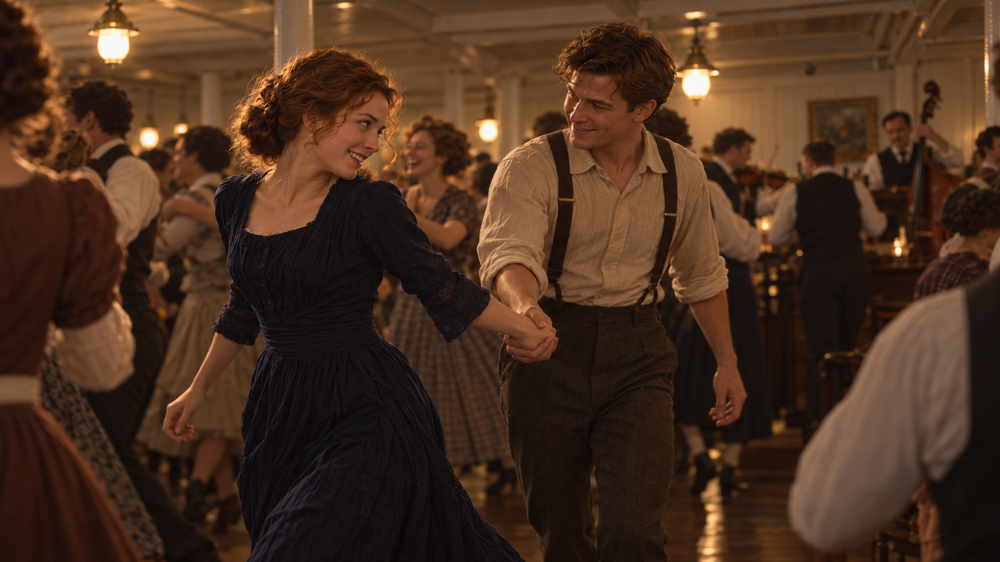
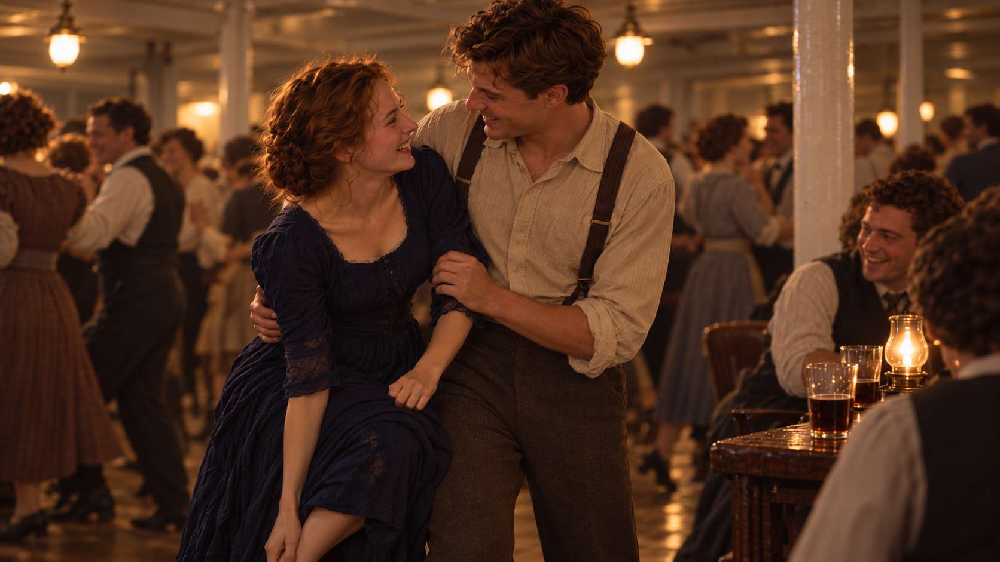

# 从《泰坦尼克号》剧本到视觉开发

这次用三等舱舞会的一段剧本，练习把人物变化转成视觉世界与关键画面。造梦师负责分析、设计与编译提示词，实际图像通过用户外部使用的 Image2 生成，再依据回传结果检查。

新用户可以这样开始：

> 请使用 $zy-cinematic-realism：<br>
> 我有一段剧本，先帮我找人物变化，再开发视觉世界和关键画面。<br>
> 区分原文事实、剧情解读和新导演建议。

## 参考修订后的视觉基准（用户认可方向）


用户评价 P01“效果还不错”，认可它作为后续视觉方向。这是原创视觉开发图，非官方电影剧照；这次最初的认可只确定后续视觉方向；下方另外记录新 P02/P03 的本轮可用反馈。

## 先读出变化，再开发世界

本例使用 James Cameron 署名剧本的第 85、87 场，公开文本可在 [IMSDb](https://imsdb.com/scripts/Titanic.html)读取。网页是第三方呈现，第 86 场标为 omitted；这份网页文本的草稿日期未核实，访问日期为 **2026-10-03**。阅读范围不包含第 88 场或全片；这里用中文简述，不复制整段原文。

第 85 场里，她刚开始不熟悉舞步，跟随男主逐渐找到节奏，随后脱鞋，主动重新投入舞蹈。第 87 场里，她穿着长袜在人群中跳舞；舞曲结束后到了桌边，展示足尖动作，落下后脚痛、抱脚失衡，被男主接住，两人与周围的人笑起来。

| 层次 | 本例怎样使用 |
| --- | --- |
| **原文事实** | 三等舱公共活动室、钢琴旁的临时乐队、最初的生涩、脱鞋后穿长袜、桌边失衡与被接住。动作顺序和鞋袜状态进入关键帧。 |
| **剧情解读** | 她从小心跟随转为主动参与，后来能够把出糗变成共同的笑。这个理解由动作支撑，不能作为新剧情事实。 |
| **视觉提案** | 用握手、身体距离、脚步与人群位置表现变化；决定取景距离、灯光层次和材料关系。具体机位、左右脚分配等是开发选择。 |

### 本次共同设计

初始实验为两版预先固定了原创造型：成年女主的棕色卷发低髻、深蓝晚礼长裙和象牙长袜；男主的栗色短发、米色卷袖棉衬衫与深灰背带长裤。房间采用浅色舱壁、深木地板、结构柱、实际暖吊灯，钢琴与临时乐队在一端，桌子在边缘。

这些是案例设计条件。**原稿写高跟鞋，本例共同采用黑色低跟鞋，是主动改编。** 不将颜色、材料或这次原创人物外观说成原稿自带信息。

视觉世界围绕“欢乐中的亲近”组织：人物处在真实舞会的人群里，脸、手与身体关系成为观看重点；背景亮度和清晰度退后，暖光有层次。共同设定进入现有 Scene Master 与连续性规则，具体画面的姿态和景别仍按动作调整。

## 从提案到图像的实际工作方式

1. **剧情分析**：确认可读范围，保留原文事件、地点、鞋袜和道具状态，解释人物变化。
2. **视觉提案**：给动作选择一个可见瞬间，说明人物关系怎样通过空间、目光与身体表现。
3. **造梦师解梦参考**：读取实际提供的参考，分别确认身份、服装、空间和光影职责；从真实图像提取可迁移关系，参考的姿势与裁切按新动作调整。
4. **编译并外部生成**：接入现有模型编译器，为用户使用的 Image2 整理提示词，由用户在外部生成并回传。
5. **检查与继续**：检查动作接触、支撑脚、手的占用、衣饰状态和视觉重心；把用户实际接受的变化用于后续。

P01 后来作为后两帧的身份、服装、场景与光影参考。它不锁定后两帧的姿势、表情或裁切，也不保证连续性已经通过。

<details>
<summary>P01 实际使用的参考修订提示词（Image2）</summary>

这条提示词保留当时提交的文字，使用时须同时提供三份参考：图一是修订前的人物与舱室图，图二提供暖色室内双人的明暗关系，图三提供人物与人群的空间关系。原任务的参考拼图不在此公开转载；替换参考后，需要先重新解梦，不能把下列图号直接当作当前参考。

```text
以图一作为人物身份、服装和1912年客轮三等舱活动室的参考。以图二中暖色室内双人画面的明暗层次为主要视觉参考，以图三的人物与人群关系辅助构图。生成一张16:9真人电影单帧，不要拼图，不引入图二、图三的人物、军装、海岸、废墟或战争情节。

表现两人刚开始跟舞的一个瞬间。男主左手握住女主右手，右手扶她腰背，正退半步带动她；她跟出一步，上身尚未完全跟上，肩膀微紧，先垂眼确认步伐。男主看她的反应，握住的手留在两人之间，不向镜头展示舞姿。保留她谨慎尝试、他耐心带动的亲近与欢乐。

镜头站在舞池边缘，走近两人，取膝以上的双人中景，重点是面孔、相握的手和身体重心变化。附近一位舞者的肩膀自然切入画面边缘，后方人群继续跳舞，让两人置身于正在发生的舞会。钢琴与乐队只需作为可辨认的背景，不再突出白柱和大片空地。

左上方的一盏既有暖吊灯照到两人的部分脸颊、肩膀和手，面孔另一侧保留自然阴影。后排舞者与浅色舱壁的亮度低于主要人物；暖色集中在受光处，暗部保持低饱和灰褐，不让整张图覆盖同一层金黄。皮肤有自然明暗起伏，深蓝裙料与棉衬衫呈现柔软哑光，背景细节自然退后。避免均匀补光、磨皮、全幅硬锐化和油亮地板。
```

原稿事件与鞋袜时间顺序继续保留，P01 仍穿鞋。这条文字连同实际参考和用户回图，记录了一次用户认可方向的修订；单独提示词不保证重现相同视觉效果。

</details>

## 本轮确认可用的后续画面

2026-10-04，用户在外部 Image2 生成并回传下面两张新图，表示“可以”。因此它们作为本案例的后续画面展示，先前差评稿仍保留未通过记录。

### P02 · 主动入场



女主在近处牵着略落后半步的男主，转脸与他相笑。面孔、握手和前后距离让主动带动的变化可见，边缘与后方舞者保留舞会的现场关系。

### P03 · 桌边相笑



桌边她弯腿靠向男主，腰侧与上臂被扶住，两人相笑；杯灯、旁桌朋友与背景舞者延续热闹的气氛。下沿有一部分腿部和抓握进入画面。

两张展示副本均只作无损 WebP 转换，尺寸与逐像素内容相等。用户确认画面可用，不等于所有具体手位、鞋袜和承重已完成连续性验收；下方保留原样提供的提示词与实际回图观察。

## 三个节点与当前状态

| 节点 | 画面任务 | 当前状态 |
| --- | --- | --- |
| **P01 · 初次跟随** | 以握手、相互观看和略显拘谨的身体关系表现尝试。 | 外部修订图已回传，用户认可作为后续视觉方向；展示在上方。 |
| **P02 · 主动入场** | 主动牵引男主，近取景突出脸、握手和前后距离。 | 新图已外部回传，用户确认可以使用；旧差评稿不作成功展示。 |
| **P03 · 桌边相笑** | 被扶住后的相笑，近取景保留桌边、接触和人群。 | 新图已外部回传，用户确认可以使用；具体足部状态未完整核验。 |

用户此前要求停止图片迭代、继续推进仓库升级，2026-10-04又要求重新处理这个案例。造梦师实际查看 P01 与两张差评稿后重编下方提示词，用户外部生成新 P02/P03 并确认可用。旧图的差评不会被新图覆盖，新的反馈也不作为受控版本比较。

## P02 / P03 本轮提供的重做提示词

本轮实际查看了已认可的 P01 与两张差评旧图，用造梦师的参考解梦、连续性和结果修复流程重编。解除先前系统选择的双人全身取景，让机位走近舞圈或桌边，减少大片亮地板，保留欢乐与既有暖灯关系。新回图的取景已经走近人物，用户确认可以使用；实际回图仍按可见内容检查。

两条使用时都附上方 P01 作为唯一“图一”，保留人物、衣服、场所与局部明暗关系，释放它的原姿势、站位和裁切。旧 P02/P03 只用于诊断，不加入新生成的参考。以下保留当时提供的两条文字，没有根据回图悄悄改写输入。

<details>
<summary>P02 · 主动入场：本轮提供的 Image2 重做提示词</summary>

```text
以图一中已确认的 P01 作为两位主角的面貌、发型、服装款式、1912 年客轮三等舱活动室和光影关系的参考，生成同一场舞会稍后的另一张 16:9 横向真人画面。保留图一的原创人物，女主的棕色卷发低髻、深蓝长裙，男主的栗色短发、米色卷袖棉衬衫、深灰背带长裤和深棕皮鞋。图一不控制这张的姿势、人物左右位置或裁切。

女主已经脱掉鞋，仍穿象牙色长袜。她主动抓着男主的左手，带他重新进入正在跳舞的人群。此刻她的身体朝舞圈斜前方迈进，转脸向落后半步的他笑；她的右手与他的左手留在两人身体之间，手肘都有余量。他顺着她的方向跟上，重心向她移动，看着她的脸。她一只袜脚已经踩地承重，另一只脚正在蹬地，步子短而轻快；空着的左手自然随步子摆动，不拎裙子展示腿脚。只定格这一步，身体的前后距离、相握的手和目光让人看出这次由她带动。

观看位置在舞圈边缘，与两人隔着两步左右，从侧前方靠近看。画面取两人的头部到大腿附近，下边缘自然裁去脚部；她在近处，他略靠后，面孔与相握的手占据主要画面。边上正在转身的舞者有一小部分肩背进入画边，后面的人继续跳舞和说笑。不要为他们清出整齐空地，也不要为了露出两双脚退回全身取景。浅色舱壁、结构柱和远处乐队只保留足够识别同一房间的部分。

沿用图一的暖吊灯与桌边小灯。来自左上方既有吊灯的暖光落在部分脸颊、手和衬衫褶皱上，脸的背光侧仍有柔和阴影；后排人物和舱壁比他们暗一些，欢乐的人群仍能辨认。暖色留在受光处，深蓝裙保留自己的颜色，暗处偏低饱和灰褐。棉布和裙料柔软哑光，肤色有自然起伏，微汗只出现在真实受光处。避免整张均匀金黄、油亮地板、磨皮和全幅硬锐化，保留这场舞会轻快、热闹、亲近的情绪。
```

</details>

<details>
<summary>P03 · 桌边相笑：本轮提供的 Image2 重做提示词</summary>

```text
以图一中已确认的 P01 作为两位主角的面貌、发型、服装款式、1912 年客轮三等舱活动室和光影关系的参考，生成同一晚舞会稍后的另一张 16:9 横向真人画面。保留图一的原创人物：女主的棕色卷发低髻、深蓝长裙，男主的栗色短发、米色卷袖棉衬衫、深灰背带长裤和深棕皮鞋。这一刻在活动室边缘的桌旁，不复制图一的舞姿与裁切。女主没有鞋，仍穿象牙色长袜，裙上保留此前溅上的一小片啤酒湿痕。

足尖展示已经结束。她因脚痛而抱脚失衡，现在已被男主接住，两人正转脸看着彼此笑。她左脚掌踩地承重，左膝略弯，身体还向他靠着；右膝弯起，右手握着疼痛的右脚，右臂向下，不把脚伸向镜头。他双脚前后错开站稳，右臂从她背后托住侧腰，左手扶住她的左上臂。她空着的左手轻放在他的左前臂上，肩膀随笑声略缩。没有人腾空，没有同时踮足尖，也没有第二个跌倒动作。

观看位置在邻桌外侧，站近他们，从斜侧看向相笑的脸和扶住身体的接触处。取头部到大腿上段的较近画面；她向下的右臂和弯着的右腿在下沿被裁切，右手仍握着画外的右脚，画外的左脚仍落在地上。桌角和一两个酒杯进入画面一侧，一位桌旁朋友正在笑，后方其他人仍在跳舞。不要退远把支撑脚、整条裙子、两人全身与乐队一起展示。她侧腰的依靠、他托住她的手、舞后的红脸和彼此的目光说明这次出糗变成了共同的笑。

延续图一既有暖吊灯的照射关系，桌上的小灯只照亮附近杯沿与桌角，不能把整间房补亮。脸颊、手和衣袖有局部暖光，背光侧与桌下保留自然暗部，背景亮度与清晰度退后。蓝裙和棉衬衫柔软哑光，汗意只是额角少量反光，啤酒湿痕轻微地加深裙料。避免均匀金黄、塑料皮肤、油亮地板和每个人同样清晰的笑脸，保持热闹中的自在与亲近。
```

</details>

<details>
<summary>实际回图观察与连续性范围</summary>

P02 把原提示词的左右手分配换成女主左手牵男主右手，主动牵引仍可读；这组左右分配本来就是候选设计，不能把变化误说成原剧本被改写。P02 的脚部被裁去，无法完整核验袜脚和落地支撑。

P03 实际有部分弯起的腿部及抓握进入下沿，与提示词“全在画外”的取景不同。女主空手落在自身裙料附近，完整脚部、落地支撑、长袜与少量啤酒湿痕没有清楚呈现，不能据此宣称所有细节执行成功。扶住与相笑是当前图可见的重点。

本轮确认两张可用，不要求因这些观察重生图片，也不作为受控 A/B 或普遍电影画质提升的证明。

</details>

初始实验的关键帧和造型由共同任务预先固定。这是受约束的剧本到视觉转化实例，不是自主选帧或全文理解测试；两版真实文字输出与比较边界见[文字比较记录](titanic-comparison-v2.5.md)。

[返回首页](../README.md) · [剧本到画面工作流](../zy-cinematic-realism/references/story-visual-development.md) · [本次验证](validation-v2.5.md)
