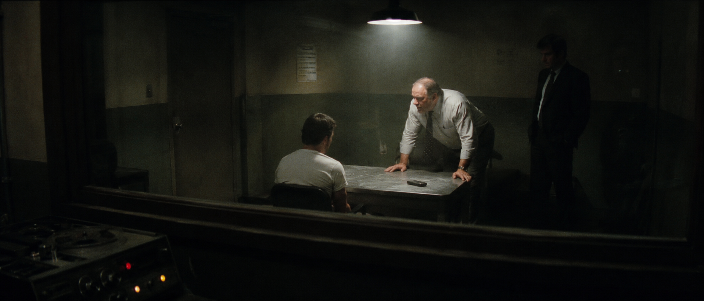
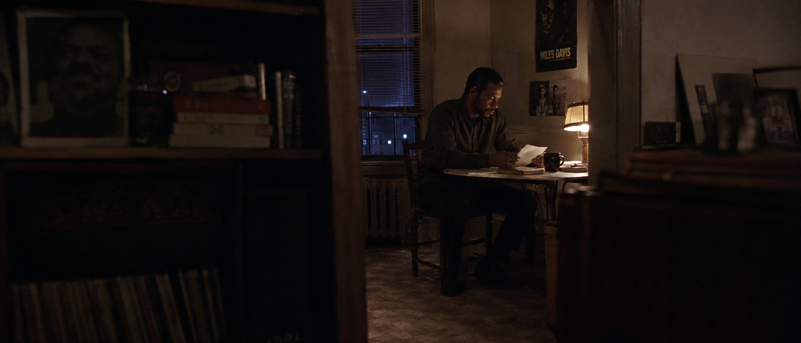
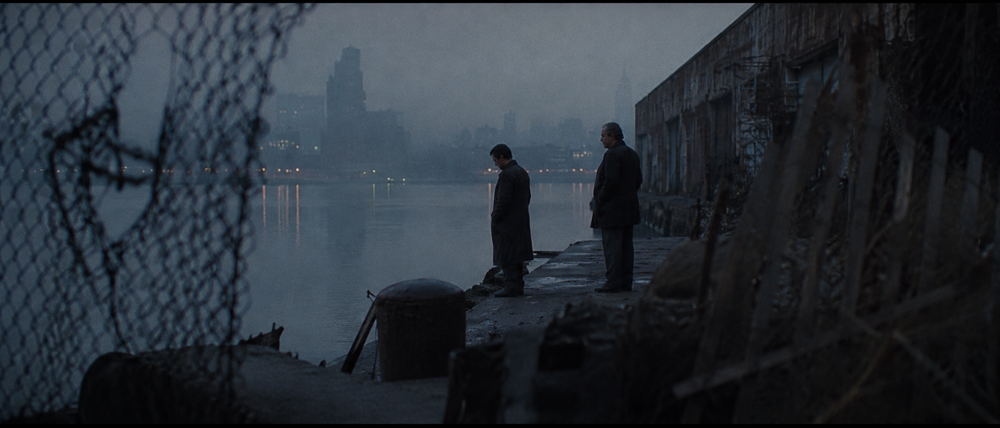
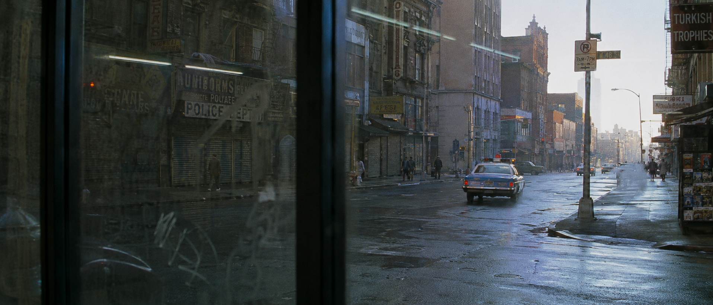
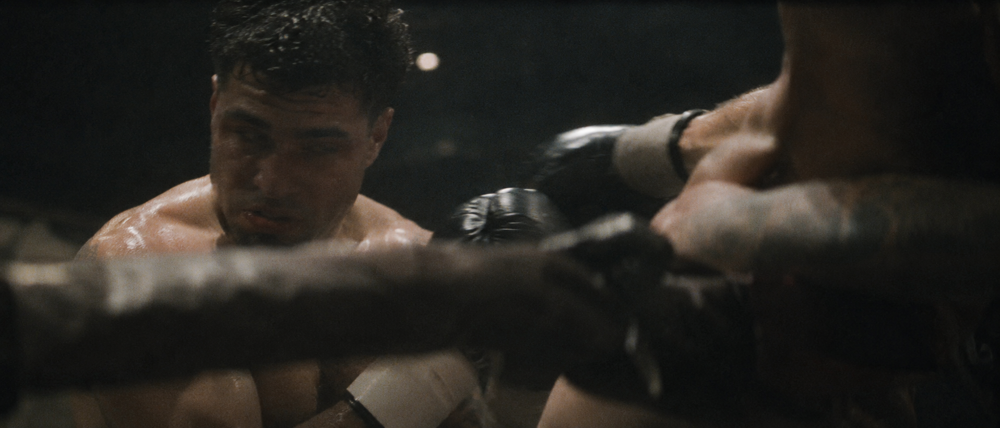

# 造梦师 · 视觉方法与历史作品

现有图片为作者此前的 AIGC 展示，未重新生成，不能据此证明 v2.4 的强度或交互改进。

[返回 README](../README.md) · [导演强度规则](../zy-cinematic-realism/references/director-routing.md)


## 连续性：Base Lock + Shot Delta

例如要做 8 镜“都市女骑士下班”组图，先用 `Continuity Bible` 锁定角色脸、银色通勤盔甲、旧帆布包、折叠长枪、车站与冷暖光源。每一镜都由同一份 `Base Lock` 加一条有限的 `Shot Delta` 生成：只描述该镜新增的动作、机位或时间变化。

这能减少脸、服装、道具、地点和光线在镜头之间漂移；它不承诺模型输出完全相同，而是让变化有据可查。

<a id="prompt-doctor"></a>
## Prompt Doctor：修图，不推倒重写

如果结果太像商业广告，问题通常不在“电影感词”太少，而在摄影机太正、人物摆拍、主辅光没有层级。Prompt Doctor 会先诊断，再输出局部修复指令：

```text
CHANGE ONLY: camera position, posing, and light hierarchy.
PRESERVE EXACTLY: identity, wardrobe, car, and location.
```

修复不是重新创作。角色身份、服装、汽车和地点继续来自原 Scene Master，只有被点名的变量允许改变。

<a id="creative-grammar"></a>
## Creative Grammar：不是滤镜，而是可执行决策

v2.0.0 保留 38 位导演的四轴视觉指纹，并新增 16 张风格卡与 8 张摄影卡。它们会实际改变光线、曝光、摄影机、空间、调度与视觉中心，而不是只附加一个风格标签。

- 风格卡可选择冷峻写实、潮湿黑色电影、静默日常、制度压迫等受控方向。
- 摄影卡可选择门框外观察、近距离被遮挡、远景负空间、程序性固定机位等观看方式。
- 导演参考继续作用于光影反差、色彩曝光、镜头机位与构图空间，不复制任何具体电影画面。

摄影参数最后才加入。它们负责强化一个已经成立的故事瞬间，不负责替代故事。

## 从一条故事里，选择不同的“那一刻”

Skill 不只是在同一个构图上换滤镜。它会帮你判断，故事里哪个瞬间最值得被看见。

### 审讯正在失控



摄影机没有坐在谈判桌旁，而是在单向玻璃外。玻璃反射、监听设备和大块暗部让观众更像一个不该在场的观察者。

### 回家以后，案件还没有结束



人物不需要哭喊。桌上的信、没喝完的咖啡、门框遮挡和一盏台灯，就能说明“他仍然放不下”。

### 真相揭开后的沉默



人物缩小、远离中心，城市与河面占据大部分画面。环境不再只是背景，而是在替角色说话。

### 主角离开，城市继续



结尾不一定需要主角特写。隔着有划痕的玻璃看警车驶远，普通人开始新的一天，故事已经结束，但城市没有停下。

## 换个题材，方法仍然成立



动作场面也不需要干净、完整的英雄构图。前景拳绳与对手身体遮挡视线，轻微运动模糊保留击打速度，人物甚至没有处在完美对焦中——它更像摄影机在搏斗中抢到的一帧，而不是体育广告。

犯罪片可以用，拳击片、家庭剧情、科幻、古装或城市短片也可以用。核心始终是：

> **不要只说“两名拳手激烈搏斗”。要说清楚这是第几回合、重拳命中的前后哪一秒、摄影机隔着什么看见他们，以及动作模糊应该保留多少。**

<a id="director-method"></a>
## 用导演的方法重新观察同一个故事

### 导演四轴视觉指纹系统

导演库把方法转成当前场景的决定，而不是只追加姓名和代表作品。四轴是内部规划与检查结构；当你要求展开导演方法时，可以分别查看：

1. `Lighting and contrast signature`
2. `Color and exposure signature`
3. `Lens and camera signature`
4. `Composition and spatial signature`

适用的轴应当是当前场景的具体决定；锁定的轴可以保持不变。最终 Prompt 的句法、密度和参数由目标模型适配器决定，不强制每次展示四轴标签。四轴按用户指定强度形成具体决定；强烈模式只在未锁定的轴与观看决定中追求结构性差异，不对用户锁定的动作、机位或构图设置变化配额。删掉导演姓名和片名后，四轴仍应明显可辨。

同一个故事因而会真正改变光影、色调、机位和构图，同时保留用户给定的年代、地点、人物、事件、真实空间和动机光。代表作品只提供模型识别锚点，系统不会复制其中任何具体场景。

| 地区 | 精选导演 | 最明显的四轴方向 |
|---|---|---|
| 华语电影 | 张艺谋、贾樟柯、王家卫、侯孝贤、杨德昌、刁亦男 | 从仪式性色彩秩序到社会转型、主观城市与层叠日常 |
| 日本电影 | 黑泽明、小津安二郎、岩井俊二、是枝裕和、黑泽清 | 从天气驱动的行动轴到家庭空间、季节记忆与不可见威胁 |
| 韩国及东南亚 | 奉俊昊、朴赞郁、李沧东、阿彼察邦 | 从阶级空间和物件欲望到道德观察与热带时间 |
| 欧洲作者电影 | 塔可夫斯基、库布里克、希区柯克、伯格曼 | 从元素记忆和制度几何到视线悬念与面孔关系 |
| 美国类型与作者 | 芬奇、林奇、斯科塞斯、科波拉、迈克尔·曼 | 从程序信息和心理异常到街头系统、家族权力与夜间职业网络 |
| 当代国际电影 | 诺兰、维伦纽瓦、马力克、卡隆、赵婷 | 从物理机制和环境尺度到身体触觉、连续社会空间与工作景观 |

[查看 38 位导演完整索引、别名和四轴摘要](../zy-cinematic-realism/references/directors/index.md) · [查看按场景目标选择导演的推荐矩阵](../zy-cinematic-realism/references/directors/recommendation-matrix.md)

```text
请使用 $zy-cinematic-realism：

1990 年代末，南方小城，一名年轻警察在停电后的录像厅里寻找失踪者留下的磁带。

导演参考：刁亦男
风格强度：强烈

请让该导演的光影反差、色彩曝光、镜头距离和空间构图分别形成明确、不可互换的视觉指令。
不要复制任何具体电影场景。
```

> v2.4 尊重轻微 / 明确 / 强烈三个强度；未指定时默认明确。锁定的动作、机位和构图不会为了导演差异被重选。下面的图片保留其历史强烈模式标注。

### 同场景四导演的根本差异

仍以“停电后的录像厅里寻找磁带”为固定故事事实：

| 导演 | 光影 | 色调与曝光 | 镜头 | 构图与空间 |
|---|---|---|---|---|
| 刁亦男 | 绿色应急灯与红色出口灯形成孤立硬光池 | 肤色疲惫、黑位密集、实际光源突兀剪切 | 稍迟一步的中广景旁观，追随动作之后才摇移 | 警察被离场人群和座椅切碎，危险藏在公共秩序里 |
| 大卫·芬奇 | 为磁带、手、登记表保留可读性的低照度 | 中性偏冷、纸白受控、次要区域进入精确暗部 | 门口的精确中景，极少移动，焦点连接信息节点 | 磁带—记录—手势形成可追溯证据链 |
| 王家卫 | 荧光灯、出口灯与雨夜门外光彼此污染 | 混合偏色、局部欠曝、实际亮源允许轻微漂移 | 隔着玻璃或座椅的压缩/轻微畸变近距观察 | 反射与遮挡把寻找变成一次错过的私人遭遇 |
| 杨德昌 | 录像厅、走廊与街道各保留普通实用光 | 真实荧光与城市材料色，不用情绪滤镜 | 邻厅或售票口的清晰中远景，保持上下文 | 建筑分隔警察、店员与离场顾客，社会关系比磁带更大 |

## 同一个故事，不同导演会看见什么？

这组压力测试固定同一个故事、人物、年代、地点和证据线索，只改变导演参考。v2.0.0 继续保留这些结构性差异，并把每个导演方向强制拆成光影反差、色彩曝光、镜头机位、构图空间四条连续签名，减少模型把差异压缩回一个综合风格句的风险。

这里的差异不是给同一张图更换滤镜，而是让不同导演重新决定“这一镜到底在看什么”。

固定场景：1980 年代中期，纽约曼哈顿，深夜警局证据室；一名疲惫侦探用城市车库员工卡比对墙上的黑白监控投影。

<table>
  <tr>
    <td width="50%" align="center">
      
      <br>
      <strong>无导演基准</strong>
      <br>
      <sub>真实调查动作、合理机位与实用光源</sub>
    </td>
    <td width="50%" align="center">
      
      <br>
      <strong>王家卫</strong>
      <br>
      <sub>主观时间、遮挡反射与未完成的深夜关系</sub>
    </td>
  </tr>
  <tr>
    <td width="50%" align="center">
      
      <br>
      <strong>斯坦利·库布里克</strong>
      <br>
      <sub>制度几何、冷静距离与秩序中的不安</sub>
    </td>
    <td width="50%" align="center">
      
      <br>
      <strong>丹尼斯·维伦纽瓦</strong>
      <br>
      <sub>空间压迫、负空间与环境中的渺小人物</sub>
    </td>
  </tr>
  <tr>
    <td width="50%" align="center">
      
      <br>
      <strong>大卫·芬奇</strong>
      <br>
      <sub>程序信息、精确机位与受控的证据层级</sub>
    </td>
    <td width="50%" align="center">
      
      <br>
      <strong>泰伦斯·马力克</strong>
      <br>
      <sub>身体停顿、触觉干扰与不完整的投影时刻</sub>
    </td>
  </tr>
</table>

| 版本 | 镜头主要在看什么 |
|---|---|
| 无导演基准 | 侦探如何完成员工卡与监控投影的比对 |
| 王家卫 | 深夜孤独、反射、遮挡与不完整的心理关系 |
| 斯坦利·库布里克 | 个人如何被制度空间和几何秩序控制 |
| 丹尼斯·维伦纽瓦 | 渺小侦探如何面对比自己更沉重的证据系统 |
| 大卫·芬奇 | 卡片、投影、照片和文字如何组成严密的信息链 |
| 泰伦斯·马力克 | 疲惫身体、纸边、袖口与投影光如何打断程序动作 |

> 所有版本都保留相同故事事实。差异来自导演对具体时刻、视觉中心、机位、调度、光线、景深和质感的重新选择。

[查看六组完整调用文本、Final Prompt 与 Avoid](director-style-comparison.md)
